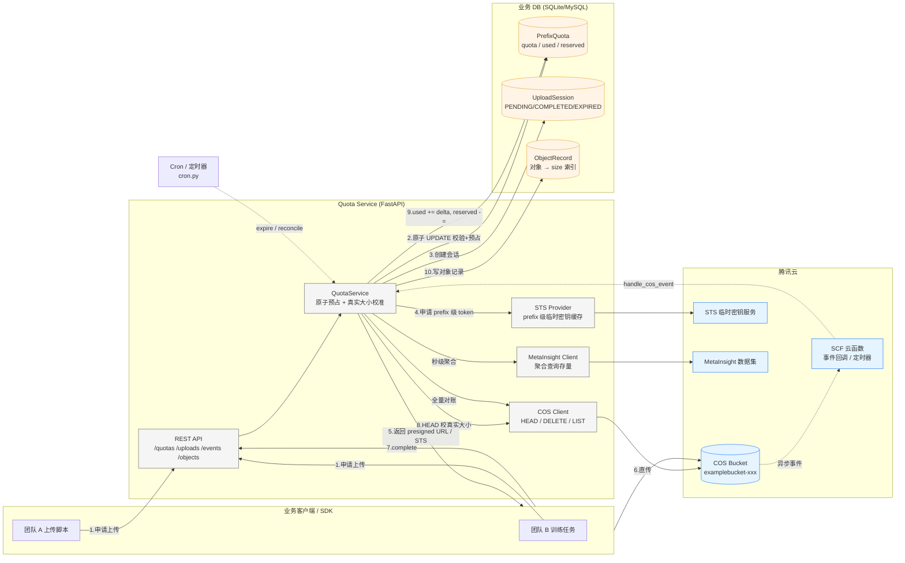
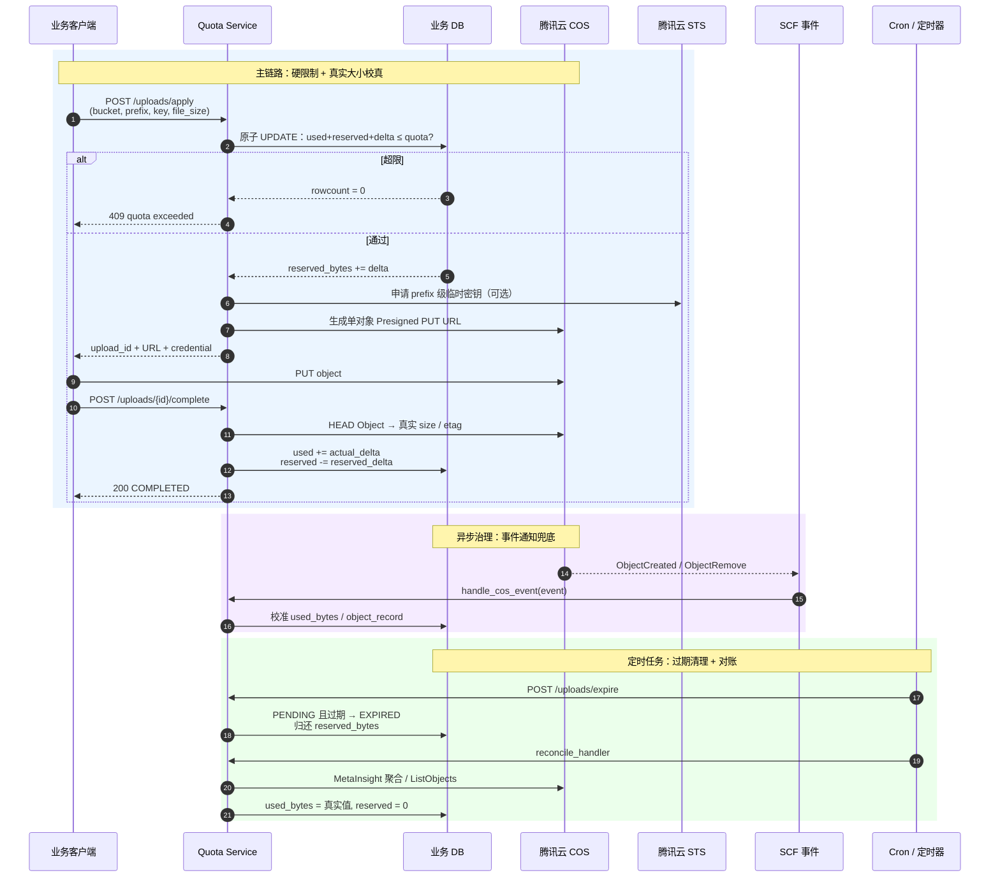

# COS Prefix Quota Service

腾讯云 COS 不支持同一 Bucket 下子目录 / 前缀的原生硬 Quota。本项目在业务侧实现一层 **前缀 Quota 控制服务**：

- 上传前：业务后端原子预占容量，未超限才下发 STS 临时密钥 / 预签名 URL。
- 上传后：通过 `HEAD Object` 确认对象真实大小，更新 `used_bytes`。
- 删除后：释放对应前缀容量。
- 事件校准：COS `ObjectCreated` / `ObjectRemove` 事件触发云函数，异步修正用量。
- 周期对账：按 prefix 遍历 COS 对象 / 调用 MetaInsight 聚合查询，修正数据库统计。

## 架构总览

整体由「**强一致主链路**」+「**最终一致兜底**」两层组成：上传前在业务 DB 内一条 SQL 完成原子预占（硬限制），上传后通过 COS 事件 + 周期对账校真实用量（软校准）。



> **关键约束**：硬限制只能由 `/uploads/apply` 在 DB 内完成（上传前），COS 事件通知和对账只能做事后校准，不能阻止控制台直传或越权写入——这是腾讯云 COS 原生不支持前缀级 Quota 决定的设计边界。

## 关键流程时序图



## 目录结构

```text
cos-prefix-quota-service/
  app/
    main.py              # FastAPI API 入口
    quota_service.py     # 核心 Quota 逻辑
    cos_client.py        # COS SDK 封装
    sts_provider.py      # STS 临时密钥封装
    models.py            # SQLAlchemy 模型
    schemas.py           # Pydantic 模型
    config.py            # 环境变量配置
    database.py          # 数据库连接
    metainsight_client.py # MetaInsight 聚合查询封装
  scf_cos_event_handler.py # SCF 事件入口
  reconcile.py             # 单次对账 CLI
  cron.py                  # 过期清理 + 全量对账（cron / SCF 定时器入口）
  requirements.txt
  .env.example
```

## 安装

```bash
cd cos-prefix-quota-service
python3 -m venv .venv
source .venv/bin/activate
pip install -r requirements.txt
cp .env.example .env
```

编辑 `.env`：

```bash
COS_SECRET_ID=AKIDxxxxxxxxxxxxxxxxxxxxxxxx
COS_SECRET_KEY=xxxxxxxxxxxxxxxxxxxxxxxx
COS_REGION=ap-guangzhou
COS_APPID=1250000000
COS_DEFAULT_BUCKET=examplebucket-1250000000
DATABASE_URL=sqlite:///./quota.db
```

## 启动服务

```bash
uvicorn app.main:app --host 0.0.0.0 --port 8080 --reload
```

## 1. 创建前缀 Quota

```bash
curl -X POST http://127.0.0.1:8080/quotas \
  -H 'Content-Type: application/json' \
  -d '{
    "bucket": "examplebucket-1250000000",
    "prefix": "team-a/",
    "owner_id": "team-a",
    "quota_bytes": 10737418240
  }'
```

表示：

```text
examplebucket-1250000000/team-a/ 最大 10GiB
```

## 2. 申请上传授权

```bash
curl -X POST http://127.0.0.1:8080/uploads/apply \
  -H 'Content-Type: application/json' \
  -d '{
    "bucket": "examplebucket-1250000000",
    "prefix": "team-a/",
    "object_key": "team-a/data/test.parquet",
    "file_size": 104857600
  }'
```

服务端会执行：

```text
used_bytes + reserved_bytes + delta <= quota_bytes
```

如果未超限：

- 原子增加 `reserved_bytes`
- 创建上传会话
- 返回限定 `team-a/*` 的 STS 临时密钥
- 返回单对象预签名 PUT URL

如果超限：

```text
HTTP 409 Quota exceeded
```

## 3. 上传完成确认

客户端上传 COS 成功后，调用：

```bash
curl -X POST http://127.0.0.1:8080/uploads/<upload_id>/complete
```

服务端会：

- `HEAD Object` 查询 COS 实际大小
- 根据覆盖场景计算 `actual_delta = actual_size - old_size`
- 释放 `reserved_bytes`
- 增加 / 减少 `used_bytes`
- 写入对象记录

## 4. 删除对象并释放 Quota

```bash
curl -X POST http://127.0.0.1:8080/objects/delete \
  -H 'Content-Type: application/json' \
  -d '{
    "bucket": "examplebucket-1250000000",
    "object_key": "team-a/data/test.parquet"
  }'
```

## 5. COS 事件通知校准

可将 COS 事件通知转发到：

```text
POST /events/cos
```

或将 `scf_cos_event_handler.py` 部署为云函数入口，监听：

- `cos:ObjectCreated:*`
- `cos:ObjectCreated:CompleteMultipartUpload`
- `cos:ObjectRemove:*`

事件用于异步修正 `used_bytes`。注意：COS 事件是事后治理，不能阻止上传；上传前硬限制必须由 `/uploads/apply` 完成。

## 6. 定期对账

```bash
python reconcile.py \
  --bucket examplebucket-1250000000 \
  --prefix team-a/
```

只查看差异，不写库。

应用修正：

```bash
python reconcile.py \
  --bucket examplebucket-1250000000 \
  --prefix team-a/ \
  --apply
```

## 核心设计点

### 这个代码能不能直接运行？

代码已经通过 Python 语法检查。要真正运行，需要先安装依赖并配置 `.env` 中的腾讯云密钥、地域、APPID 和 Bucket。

Demo 默认使用 SQLite，适合本地验证；生产环境建议换成 MySQL / PostgreSQL / TiDB，并用 Alembic 管理表结构。

### 每次上传都要获取 STS，时延怎么保证？

不一定每次都要重新获取 STS。本项目支持两种模式：

| 模式 | 配置 | 特点 |
|---|---|---|
| 单对象预签名 URL | `ISSUE_STS_ON_APPLY=false` | 上传前只做本地签名，时延低，且最接近单文件硬限制 |
| 前缀级 STS | `ISSUE_STS_ON_APPLY=true` | 适合分块上传 / 批量上传；代码里已做 prefix 级 STS 缓存，未过期前复用 |

如果客户对 quota 严格要求最高，建议用单对象预签名 URL；如果需要大文件 multipart 或批量上传，则使用前缀级 STS，但客户端必须始终先调用 `/uploads/apply` 做容量预占。

### 为什么要 reserved_bytes？

多用户并发上传时，如果只看 `used_bytes`，多个大文件可能同时通过校验，最终超额。`reserved_bytes` 用于上传前预占空间。

### 为什么要 STS 限制 prefix？

用户不能拿永久密钥，也不能拿整个 Bucket 权限。STS 临时密钥只允许访问：

```text
team-a/*
```

这样可以避免用户绕过业务侧 Quota 控制写入其他团队目录。注意：如果客户端恶意拿着 prefix 级 STS 直接上传未申请的对象，服务端只能通过事件和对账事后发现；严格强控制场景应使用单对象预签名 URL 或后端代理上传。

### 覆盖上传怎么处理？

同名对象覆盖时按增量计算：

```text
delta = new_size - old_size
```

如果新文件更小，则释放空间。

### 分块上传怎么处理？

申请上传时必须提交总大小，服务端按总大小预占。上传完成后再用 COS `HEAD Object` 校准真实大小。

## 生产建议

1. 禁止客户端使用永久密钥。
2. 所有上传必须先走 `/uploads/apply`。
3. STS policy 必须限制到团队 prefix。
4. 大文件上传必须预占容量。
5. 删除、覆盖、分块上传要独立处理。
6. COS 事件用于异步校准，不可作为硬限制。
7. 每日使用 COS Inventory 或 `reconcile.py` 做全量对账。
8. SQLite 仅适合 Demo，生产建议使用 MySQL / PostgreSQL / TiDB。

## 涉及 COS 接口 / 能力

- `Put Object`：上传对象
- `HEAD Object`：确认对象真实大小
- `Delete Object`：删除对象
- `List Objects`：按 prefix 对账
- `InitiateMultipartUpload` / `UploadPart` / `CompleteMultipartUpload`：分块上传
- `COS 事件通知`：上传/删除后触发云函数
- `STS 临时密钥`：限制客户端只能访问指定 prefix
